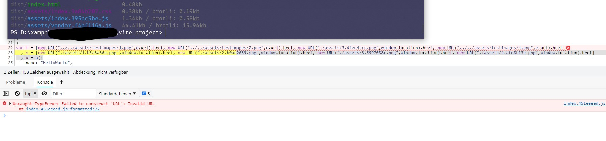

# Reproduce issue #4416 like this

1. `npm install`
2. `npm run dev`
3. see http://localhost:3000/ and you should see 4 images. toggling the "greyscale" button changes the image sources
4. `npm run build` or `npm run serve` to inspect production build
5. open the production build in a browser. you should see, that 
   
    a. Not all assets have been exported (assetsInlineLimit is set to 0, in order to avoid inlining images.)

    b. There is an error in the developer console (see screenshot). following it in the production js (dist/assets/index.*.js) you will see, that not all the `new URL("")` paths have been correctly transformed

